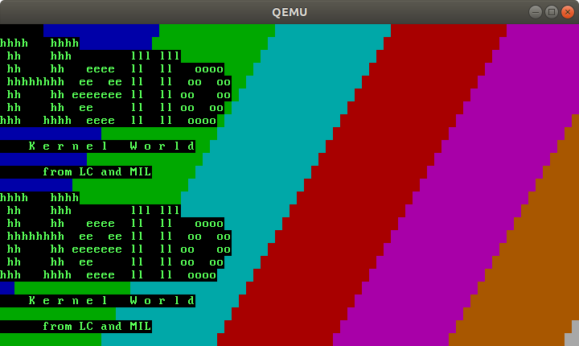
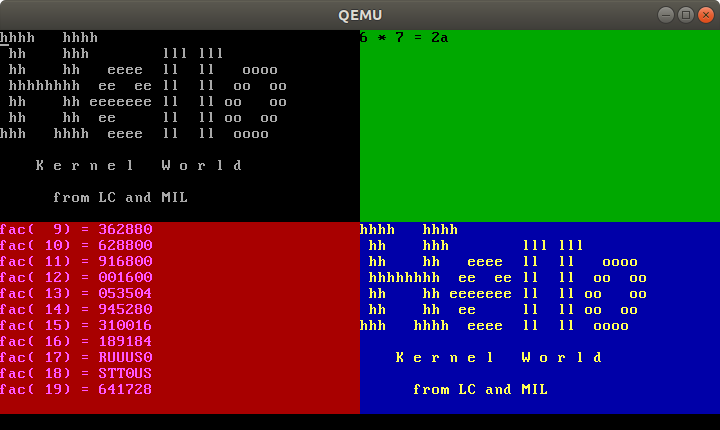
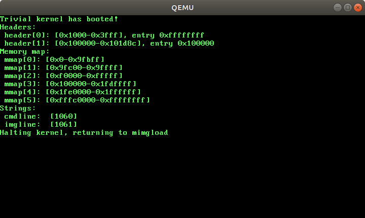
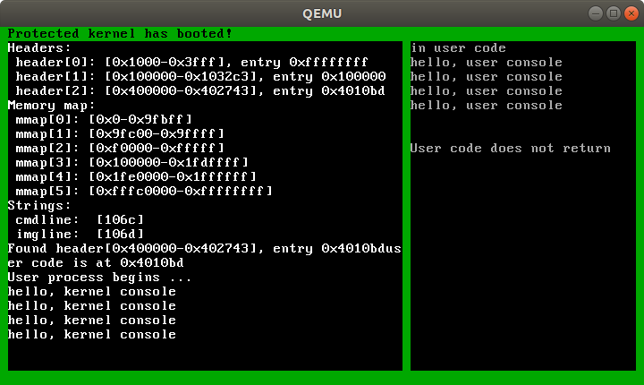

# Bare metal experiments using LC and mil-tools

This repository contains a collection of examples of bare metal
programs written using LC and mil-tools.

Most of these examples are based on original implementations
that were written in C as demos or exercise materials for the
[Languages and Low-Level Programming Course (LLP).](http://web.cecs.pdx.edu/~mpj/llp/).
In particular, you can find a detailed set of instructions for
building a virtual machine that is suitable for running these
programs by [clicking here](http://web.cecs.pdx.edu/~mpj/llp/vminstall/),
and the source code for the original LLP demos is also available
on GitHub by [clicking here](https://github.com/zipwith/llp-labs).

The programs in this repository are mostly written in LC, and
you will need a copy of mil-tools (https://github.com/habit-lang/mil-tools)
to compile an run them.  LC was intended to be used primarily as an
intermediate language for our Habit compiler, which uses mil-tools
as its back end and alb (https://github.com/habit-lang/alb) as its
front end.  Our long term goal is to transition all of these examples
to Habit implementations, which will give us access to a broader
range of language features and to avoid some of the awkward details
that can be expected from trying to create programs in an
intermediate language that was not originally intended to be used
for handwritten code.  Nevertheless, we hope that the resulting
code will be relatively easy to understand, and that it will
help to give some indication of what will ultimately be possible
using Habit.

The current set of demos in this repository includes:

### serial-lc

A demo program that boots up on bare metal and outputs text to
the serial port.  Among other things, this demo illustrates the
techniques that we use to provide access to assembly language
instructions, captured in an LLVM wrapper, that allows them to
be fully inlined with the rest of our generated code.

### hello-lc

A demo program that boots up and displays a simple message
against a background rainbow of colors by writing to video RAM:

### winhello

An expanded version of the hello-lc demo that writes to four
separate tiled windows in video RAM.

### example-mimg-lc

A demo program that displays data about available memory and
loaded programs by inspecting boot data headers that are passed
on by the mimg (memory image) bootloader/shim.

### example-idt-lc

A demo program that features separate kernel and user mode programs.
After the necessary data structures have been initialized (including
the IDT or interrupt descriptor table that is needed to enable system
call access), the kernel runs the user mode program but remains active
to handle simple system call requests as needed.  The following screenshot
shows the results of running this program with kernel output in a window
on the left of the screen and user program output on the right.

### switching-lc

This demo illustrates the construction of a simple kernel that uses
context switching to allow the execution of two user level programs
at the same time.  The kernel uses timer interrupts and simple round
robin scheduling to ensure that each of the two user programs are
given an opportunity to run.  As an additional twist, the two user
programs are written to illustrate that it is possible for one program
to interfere with the other by writing in to the other's address space.
(The fact that all of the programs are already writing in to the same
shared video RAM memory already makes the same point in a slightly less
obvious way.)  This provides motivation for introducing features to
support protected mode execution in later demos.  The following
screen shot shows the results of running this program with kernel
output on the left and two separate user program windows on the right.

### libs-lc

Many of the demos described above depend on libraries that are
packaged together in the libs-lc folder.  (These are used in
addition to the standard LC libraries in `mil-tools/lib` that
provide more general functionality.)  The library files in
libs-lc include:

* `vram.llc`: A simple video RAM library that includes functions
  for clearing the screen and writing data to screen.

* `wvram.llc`: An expanded version of `vram.llc` that supports
  the definition and use of multiple "windows" within the video
  RAM

* `ia32.llc`: A library of functions for working with low-level
  IA32 data structures, including contexts (for capturing CPU
  registers), and page tables and page directories for working
  with the MMU.

* `cursor.llc`: The beginnings of a general library for using
  "cursor" abstractions to traverse variable size data structures
  in a safe manner.

* `mimg.llc`: Functions for reading and displaying the bootdata
  information that is passed on by the `mimg` tool.

* `portio.llc`: Access to IA32 port IO, supported by the
  LLVM and assembly code fragments in `portio.ll`.

* `pc-hardware.llc`: Functions for working with the programmable
  interrupt controllers (PICs) and the programmable interval
  timer (PIT) on a standard PC platform.

* `intervals.llc`: Code for working with sets of intervals (that
  typically represent ranges of available or reserved memory
  addresses).

